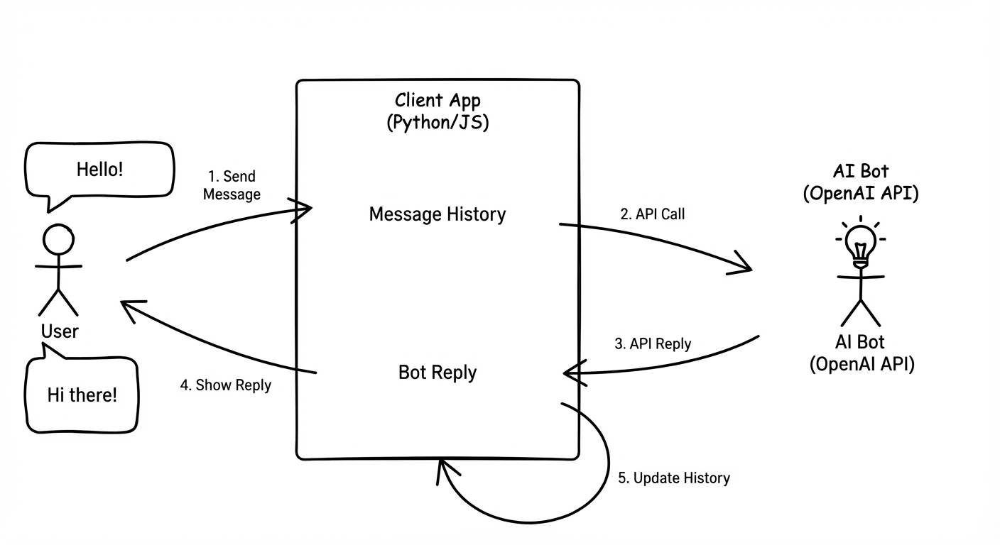
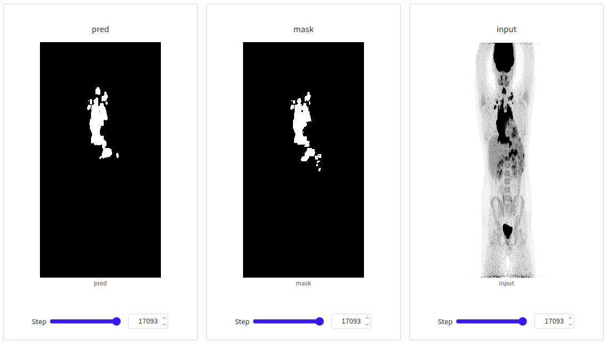

# cogintro

<div align="center">


[](https://opensource.org/licenses/MIT)

**Cogito NTNU's Introduction Group**

</div>

## Overview

This repository contains materials and projects from Cogito NTNU's introduction group. Unlike regular Cogito projects that focus on a single target throughout the semester, CogIntro covers a broad range of AI/ML topics to maximize learning. The group of 8 members met twice a week in afternoon sessions, with each subproject spanning 1-4 weeks. The progression went from foundational tooling through increasingly complex applications, ending with a deep learning project on HPC infrastructure.

### Course Progression


## Projects

### Fundamentals

Terminal usage, Git workflows, and introductory ML concepts via Kaggle notebooks.

### Flappy Bird Agent

A reinforcement learning agent trained to play Flappy Bird using the OpenAI Gym framework.

<div align="center">
<a href="src/flappy-bird-gym">

</a>

[Project folder →](src/flappy-bird-gym)
</div>

### LLM Chatbot

A conversational chatbot built with OpenAI's Responses API.

<div align="center">
<a href="src/large-language-models">

</a>

[Project folder →](src/large-language-models)
</div>

### Tumor Segmentation on IDUN

Medical image segmentation using U-Net architecture, trained on NTNU's IDUN HPC cluster via SLURM. The model segments tumor regions from PET/CT scans using k-fold cross-validation.

<div align="center">
<a href="src/tumor-segmentation">

</a>

[Project folder →](src/tumor-segmentation)
</div>

## Prerequisites

- **Git**: [Download Git](https://git-scm.com/downloads)
- **Python 3.12**: [Download Python](https://www.python.org/downloads/)
- **UV**: Python package manager. [Install UV](https://docs.astral.sh/uv/getting-started/installation/)

## Getting Started

```sh
git clone https://github.com/CogitoNTNU/cogintro.git
cd cogintro
uv sync
```

For development:
```sh
uv run pre-commit install
```

## Repository Structure

```
cogintro/
├── src/
│   ├── flappy-bird-gym/     # RL environment and agent
│   ├── large-language-models/  # OpenAI chatbot notebook
│   └── tumor-segmentation/  # U-Net model and SLURM scripts
├── docs/
└── tests/
```

## Team

<table align="center">
    <tr>
        <td align="center">
            <a href="https://github.com/maiahi">
              <br />
              <sub><b>maiahi</b></sub>
            </a>
        </td>
        <td align="center">
            <a href="https://github.com/AlMinaDO">
              <br />
              <sub><b>AlMinaDO</b></sub>
            </a>
        </td>
        <td align="center">
            <a href="https://github.com/arlindakm">
              <br />
              <sub><b>arlindakm</b></sub>
            </a>
        </td>
        <td align="center">
            <a href="https://github.com/flatval">
              <br />
              <sub><b>flatval</b></sub>
            </a>
        </td>
    </tr>
    <tr>
        <td align="center">
            <a href="https://github.com/Knolldus">
              <br />
              <sub><b>Knolldus</b></sub>
            </a>
        </td>
        <td align="center">
            <a href="https://github.com/Jarandvs">
              <br />
              <sub><b>Jarandvs</b></sub>
            </a>
        </td>
        <td align="center">
            <a href="https://github.com/ApatShe">
              <br />
              <sub><b>ApatShe</b></sub>
            </a>
        </td>
        <td align="center">
            <a href="https://github.com/svemyh">
              <br />
              <sub><b>svemyh</b></sub>
            </a>
        </td>
    </tr>
</table>

## License

Distributed under the MIT License. See `LICENSE` for more information.
